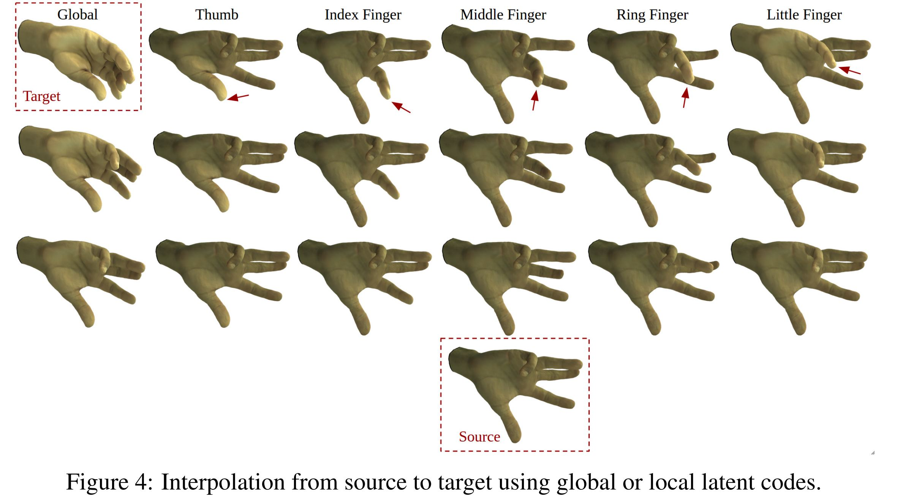

# Fully Convolutional Mesh Autoencoder using Efficient Spatially Varying Kernels

Code for the paper [Fully Convolutional Mesh Autoencoder using Efficient Spatially Varying Kernels](https://arxiv.org/pdf/2006.04325.pdf), arxiv 2020.

## Introduction

<div align="center">
  
</div>

Learning latent representations of registered meshes is useful for many 3D tasks. Techniques have recently shifted to neural mesh autoencoders. Although they
demonstrate higher precision than traditional methods, they remain unable to capture fine-grained deformations. Furthermore, these methods can only be applied
to a template-specific surface mesh, and is not applicable to more general meshes, like tetrahedrons and non-manifold meshes. While more general graph convolution
methods can be employed, they lack performance in reconstruction precision and require higher memory usage. In this paper, we propose a non-template-specific
fully convolutional mesh autoencoder for arbitrary registered mesh data. It is enabled by our novel convolution and (un)pooling operators learned with globally
shared weights and locally varying coefficients which can efficiently capture the spatially varying contents presented by irregular mesh connections. Our model
outperforms state-of-the-art methods on reconstruction accuracy. In addition, the latent codes of our network are fully localized thanks to the fully convolutional
structure, and thus have much higher interpolation capability than many traditional 3D mesh generation models.


This repo contains:

1. "GraphSampling" is a C++ code for sampling on the mesh template to generate the connectivity structures for learning. Please use the cmake to create the MakeFile for compiling.Please look at the help in the function to know how to run it. It will take an template mesh and output the sampled connectivity file to the output path. 

2. "GraphAutoEncoder" is a python code which uses PyTorch to train an autoencoder on a sequence of registered meshes with the same topology with the template mesh used in "GraphSampling". It takes a configuration file as input (One example of configure file is named "config_train.config"). The main training file is "graphVAE_train.py". The proposed mesh conv operator is defined in "graphVAESSW.py".

Please see [INSTRUCTIONS.md](INSTRUCTIONS.md) for the usage.

## License

This project is under the CC-BY-NC 4.0 license. See [LICENSE](LICENSE) for details.

## Citation

If you use our code, models or wish to refer to our results, please use the following BibTex entry:
```
@InProceedings{Yi_2020_ARXIV,
  author = {Zhou, Yi and Wu, Chenglei and Li, Zimo and Cao, Chen and Ye, Yuting and Saragih, Jason and Li, Hao and Sheikh, Yaser},
  title = {Fully Convolutional Mesh Autoencoder using Efficient Spatially Varying Kernels},
  booktitle = {arxiv},  
  year = {2020}
}
```


